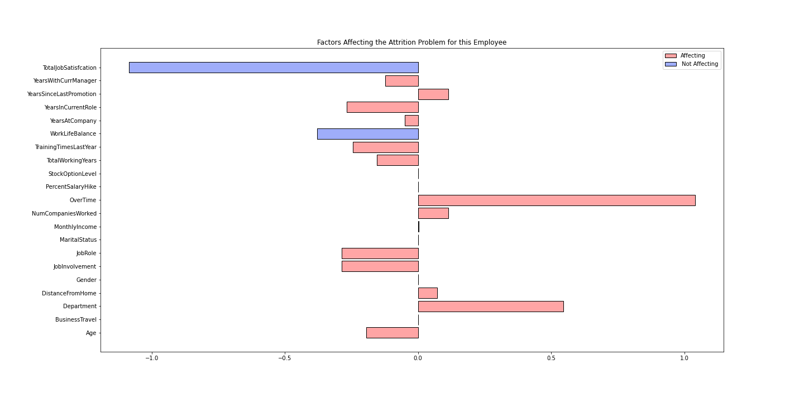

# HRAttritionStudy

# Business Objective 

To demonstrate the financial and company benefits of using predictive analytics to drive employee retention. 

Modeling Key Question 
How to reduce employee attrition using data?

# Introduction 

Employee turnover is the percentage of individuals leaving the company and replaced by new ones. Employees leaving the company, especially those who are highly valued, pose one of the biggest concerns to global organizations. It's such a problem that “87% of HR leaders consider improving retention a critical or high priority for the next five years” (1). When a highly trained employee leaves, it can cost more than 200% of their annual salary to replace them (1). The costs come from investing resources into hiring and training the new employees and certifying them in the course of their development. There are other factors which also need to be considered for example the relocation expenses, a signing bonus, paying headhunters to find the employee; this can become expensive especially when looking for employees outside the company as the process can take longer as well. Included in financial losses is also the company’s lowered business performance which can lead to reduced profits. When less experienced workers are retained, the quality of business solutions and services that are provided to the customer are reduced, which decreases the customer satisfaction rate and can again lead to reduction in profit. To add, customers tend to get attached to certain employees and if that employee is not retained, it comprises their relationship with the company (especially in the sales sector). When a new employee comes in, a period of adjustment is required. It might take them longer to finish tasks which causes delays and decreases productivity. Additionally, large turnover can negatively affect a company’s reputation. This is a problem which many companies face since about 50% of all organizations globally have difficulty retaining some of their most valuable employee groups and about 25% of employees are in the high-retention-risk category (1). Assuming that a company has 100 highly valued employees earning let’s say $100,000 or more a year, the possibility that one in every four individuals in this category is planning on leaving can pose a lot of problems for the company. Assuming these 25% of employees were to leave, the expenditure for replacing them can go up to $5 million. This is for a small scale, imagine the financial impact of a company that has employees in the scale of thousands. This is just the financial impact, without looking into other impacts such reputation, quality and quantity of work and more. Therefore solving this problem becomes essential for organizations; it would be very useful for human resources to know which employee is highly likely to leave and based on that find ways to keep them in the company (especially if they are in the highly valued category). The objective of this project will be to find out which employees are most likely to leave.

Tools used: 
1. IBM HR analytics employee attrition and performance dataset from Kaggle 
2. Python 3.7
3. Open source libraries: Pandas, Numpy, Seaborn, SciKit Learn ,MatPlotLib, Tensorflow/Keras

After understanding the impact of the loss of highly valued employee, it is important to understand what factors influence the employee’s decision to stay or leave. The number one reason why people stay in the company is because they are happy with their job. However, the feeling of happiness comes from a combination of factors. Generally people are happy when they are learning and developing: a survey by docebo found that 59% of employees consider learning opportunities important to workplace happiness (2). Therefore opportunities for growth and progression become a significant factor in employee turnover; 36% of questioned people (and 48% of millennials) said they would quit a job due to a lack of learning and development opportunities (2) and 70% would leave the organization to advance their careers (1). Individuals like to feel useful when working and knowing they are contributing to the company. Those who are not given the opportunity to grow and learn tend to feel inadequate which make them less engaged with their work. Individuals who are highly engaged with their work are 75% less likely to look for jobs compared to those who are unengaged (3). To add, employees like to receive recognition and appreciation for the work they put it as it makes them feel valued and appreciated, generally in the form of awards and compensation/raise in salary (79% people leave if they feel that they are not recognized (4)). A survey by Gallup has indicated that employees who do not feel they are recognized enough are twice as likely to quit within the next year (1). Employees are willing to take a role with a different company for a raise of 20% or less (1). 

Another factor which seems to play a very important role in making people leave the company is management. Employees who are being overworked are generally not happy and this generally leads to an unhealthy work life balance. About 23% of employees leave their company because of feeling burned out (5). This makes them 2.6 times more likely to look for another job and about 63% more likely to call in for a sick day (6). Assuming that the employee does not leave the company, overworking is definitely something that would harm the organization in the long run since their work quality is most likely going to deteriorate. They would not be as effective in the amount of work they are able to produce because of lack of energy which would mean that the company is not performing as well. 45% of HR leaders have stated that burnout is responsible for 50% of their annual turnover (7).
 
Bosses also seem to play another factor in people management, since they are responsible for delegating the work out to employees. When the bosses do not utilize the strengths of their workers to delegate tasks, it can create problems since employees may start feeling inadequate and as if they have been hired for the wrong reasons; about 80% of turnover is due to bad hiring decisions (8). However, if the boss utilizes the strengths of the employees in the team, they are more likely to enjoy their job which aids retention. To add, employees are  more likely to leave if their boss does not show enough empathy: 93% would stay if bosses showed more empathy (9). Lastly, another reason why people leave is due to lack of cultural fit; the lack of flexibility can make employees feel out of place: 61% leave their job due to lack of work culture flexibility options (10), and employee happiness is 23.3% more correlated with co-workers rather than direct supervisors (1). 

When management is transparent it leads to a 30% better retention rate (1); therefore, it shows the importance of having a good HR team and making sure that the people management is done well. People also stay for job security as 41% of employees listed job security as the most important reason to stay in the company (1).

Reasons for people to stay based on research
1. Job security 
2. Happiness: Engagement, Training which allows for growth, Using strengths/ feeling useful, Recognition,Cultural Fit/Work Life Balance, Bosses

Reasons for people to leave
1. No chance for growth/training - feeling inadequate
2. Lack of recognition
3. Bad bosses - lack of empathy and recognition
4. Burned out 
5. Lack of cultural fit 

Expectations: 
The aim of this investigation is to determine which features, the data suggests, have a higher impact on determining whether an employee decides to leave the company. After the analysis, the end product is a machine learning model which determines, based on the current situation of the employee, whether they will leave or stay. In the UK, every quarter/ half year an appraisal scheme is done, which is where employees are evaluated against goals from the previous appraisal scheme to provide feedback for regular chances for a promotion. If this survey/measurement was taken before the appraisal scheme the HR team could gain an insight into which employees are likely to leave before conducting post-scheme interviews. In the case of an explainable model, the HR team would be able to understand which factors in particular are making the employee unhappy (based on the data); the HR team would be able to go into the meetings with the employee with a plan and discuss ways in which their life at the company could be improved. This way the model can be used as a tool to aid retention and increase the rate of retention.

# Data 

The data comes from IBM scientists and was posted on the Kaggle Platform with the title "IBM HR Analytics Employee Attrition & Performance: Predict attrition of your valuable employees". 

The data has 1470 rows and 35 columns. Below is the list of columns:
Age, Attrition, BusinessTravel, DailyRate, Department, 'DistanceFromHome', 'Education', 'EducationField', 'EmployeeCount,EmployeeNumber', 'EnvironmentSatisfaction', 'Gender', 'HourlyRate', 'JobInvolvement', 'JobLevel', 'JobRole', 'JobSatisfaction,MaritalStatus', 'MonthlyIncome', 'MonthlyRate', 'NumCompaniesWorked','Over18', 'OverTime', 'PercentSalaryHike, 'PerformanceRating', 'RelationshipSatisfaction', 'StandardHours', 'StockOptionLevel', 'TotalWorkingYears, TrainingTimesLastYear, 'WorkLifeBalance','YearsAtCompany', 'YearsInCurrentRole' ,'YearsSinceLastPromotion','YearsWithCurrManager'
       
However prior to the exploring the data I deleted the HourlyRate, Daily Rate, MonthlyRate columns because their defintions were not conistent with the definitions provided. To add, I deleted columns such as Over18 and StandardHours because they provided no unique values and the Employee Number and Count because they don't provide any value in the machine learning and data analysis. 

# Exploratory Data Analysis 

Correlation Matrix
 

Important relationships

 

The above marks all the important relationships between variables, I am using 0.5 correlation as the benchmark for an important relationship because anything above 0.5 marks a moderately positive relationship.

The greater the age of an employee the greater the total working years, which is expected as both values keep on going positive (while still working). It also shows how there is a strong correlation with salary and job level as a higher job level generally indicates more important roles and more valuable employees which lead to an increase in salary. To add, having a higher correlation with TotalWorkingYears was also expected as the more you work the greater the increase in knowledge and experience with the work which would increase the chances of going up higher in the hierarchy and increase the monthly income. It also shows how the higher job level of an individual the higher the number of years the employee has worked in the company. This is generally a preferable way of companies working because ideally they would want people at higher positions to come from lower positions within the same company due to their better understanding of the industry and the inner workings. There seems to be a highly positive relationship between the performance rating and the salary hike, which indicates that people who perform well get rewarded for the work put in and vice versa. With the assumption that the definition of a promotion means that the job level has gone higher; the data suggests an obvious relationship between the years an employee works in the current role and the number of years since they got their last promotion. A thing to bear in mind is that the dataset includes both high level and low level employees, and when people go higher up the roles the lower the chances/years for a promotion because there a not a lot of steps to go up. 

The highly positive relationship between years an employee is at the company and the number of years they are with the current manager implies that generally during the employees time at the company their manager does not change; to add, it also shows that the there is a strong relationship with the number of years they are in the current role which could indicate that getting promotions could be difficult at this company (however, as the job level gets higher it becomes difficult to get promotions as well). It also shows that when you are in the same role, the likelihood is that the manager will be the same while the employee is in that role.

Numerical features

The dataset contains 20 numerical features that could play a role in employee attrition. The grid above compares these features and shows in red the probability of an employee leaving and in blue the probability of them staying. The main highlights from this grid are the following. Employees below the age of 35 seem to be more likely to leave which can be attributed to their “freer” lifestyle and lower need to settle down. Younger people are also less likely to be married and have a family to support thus require less job security. Distance from home also plays an important role since long commutes and a lot of time spent traveling can discourage people from going to work and enjoying it. Large commute times also affect employee work-life balance and decrease their satisfaction. Employees at the lowest level in the company are at most risk of leaving which can be attributed to them figuring out whether they enjoy the job, the environment, the relationships in the workplace and looking for high salaries and growth opportunities. This risk surprisingly does not seem to be well countered with salary increase, as the difference between people leaving and staying depending on their salary increase is not significant. Monthly income in total can help retain employees for higher income values, however can be a reason to leave at small values. 5000 units in this dataset are the “deciding” value that divide the set between people staying and leaving.The feature that seems to have a huge impact on employee retention is the opportunity to buy stock, as employees with stock options have a much higher probability of staying. This feature has a binary type of role, meaning the option to have stock makes employees stay and the lack of this option can cause them to leave. There is also a similarity in behavior for years in current role and with current manager, which implies that how long someone stays is also dependent on what kind of manager they have. Lastly overall satisfaction with a job, which includes work life balance, job involvement and job satisfaction, all contribute to employee retention when satisfaction is high, however no significant attrition is found for low satisfaction.

Categorical Features

The dataset contains 7 categorical features that could play a role in employee attrition. The grid above compares these features using bar plots. The red shows the individuals in that particular category that left the company and the blue the employees who remained. The main highlights from the grids are the following. Employees who are single are more likely to leave the company, this could be due the fact that they have less factors to worry about and could be younger, looking to find their way in the industry. When one is married one has to think about a lot of factors before moving companies because it can affect their family (particularly if they have kids). Employees who travel frequently have a high chance of leaving. This could be because they do not get to spend a lot of time with family and can affect their work life balance quite a lot. The job role factor mirrors what the job level was saying in the numerical features; individuals who have a higher job level for example Directors and Managers are more likely to stay the in company. This could be due to the fact that they are highly valued and are well compensated for the job they do. However, individuals who work as a Sales Representative and in Human Resources are the most likely to leave the company based on the statistics. The most important feature that the grid shows is that overtime has an impact on employees who want to leave and stay alike. A lot of the employees who leave the company tend to be working overtime. Working overtime would generally imply that the individual has less time to for their family which would make them dissatisfied with their job as they could feel like the job is taking over their life.

From the above 27 features these are, according to the dataset, the most important features which are likely to leave the company: below 35 years old, earning below 5000 per month, living at least 10 units away, employees who work at lower levels, employees who don’t have stock in the company, employees who work over time, employees who are single. 

# Machine Learning 

Before building the model it is important to understand how the model would be used and what metric would be used to determine the success of the model. Depending on whether the model is explainable or not the next step would be different. If the model is explainable the HR team would be able to understand which factor is important and (if possible without a meeting if needed) try to change the environment for the employee so they don't have that much incentive to leave. If the model is not explainable the HR team would need to study the employee to understand why they want to leave and have a meeting with them to understand how the individual is feeling and how they can change their lifestyle in the company. Both processes are very expensive which is something to bear in mind. 

Accuracy is not the best metric to use here because it is possible to have a reasonably good accuracy (in this case 84%) by predicting that everyone will stay in the company, but that does not solve the issue of attrition since the company still looses money and the employees and all the other factors such as reputation, loss in productivity and more are not mitigated. Since the protocol of making an employee stay can be expensive (doesn't have to cost money, still can cause the HR team time) it is important that whoever the model flags as vulnerable to leaving, there is a good confidence in that flag to be correct. The aim would be to have high precision with a decent recall. If the company is not bothered with the cost or it does not cost that much to change the employee's work factors, then a good measurement to take would be recall because that way the model would be able notice a lot of the employees who were going to leave prior to the HR intervention, but the confidence in the model may not be high. The precision recall tradeoff implies that the higher the precision the lower the recall and vice versa. Because I am hypothesizing that this procedure will be expensive I am choosing to keep a model that will have high precision and a reasonable recall. 

Precision/Recall

# Feature Engineering 

Most of the feature engineering described below stems from the previous analysis which already pointed at some important relationships. I converted the stock level data to a ‘yes/no’ type dataset since the previous analysis showed there was a binary relationship between having stock and not wanting to leave. I converted Overtime to either 1 or 0 from Yes and No. Due to the fact that males presented the majority of the data (data had only two genders) and males were more likely to leave than females, I converted the gender role to indicate 1 meaning the person was male and 0 to female. I also converted Marital status to 0 or 1 depending on whether they are single or not since the analysis suggested that if the person was single to 0 and 1 to whether they were married or divorced. I also converted business travel to 1 or zero if the individual travel frequently because the majority of the people that leave come from that category. Since the jobsatisfaction, environment satisfaction and relationshipsatisfaction all had very similar distributions in the analysis, I combined them into one feature and deleted the respective columns. To add, I dealt with the categorical columns job roles and department using the mean income from individuals with that role and department respectively because from the analysis I felt like the monthly income provided better understanding of those columns than using pandas dummies. I used minmax scaler to scale the whole matrix as well and used train test split (70-30) using stratify to make sure the probabilities of employees leaving the company stayed consistent. This means that I trained the models using 1029 employees records and tested in on 441 employees. Out of these 71 were marked as those who were thinking of leaving.

# Machine Learning Model 

After experimenting with the different machine learning models and different feature engineering techniques I was able to create two models which are pretty close to what I was aiming for (higher precision and a reasonable recall while maintaining a good accuracy). 

Linear SVM 
The following are the results which it produced:

   
The good thing about Linear SVM is that they are explainable; so when the model predicts than an employee is going to leave the company; they can understand (based on the data) which factors are making them want to quit the job. Below is an example of an employee when the model predicted was going to leave the company. 
 
 
 
 
 
The above is an example showing how the explainability of the model helps the HR team understand which factors are affecting the decision of the individual for leaving the company. The way the model gets an answer is by doing a multiplication of coefficents with the features; the closer the sum is to 1, the predicted value will be else 0. The coefficents vary from negative numbers to positive numbers; but the features will always be positive (or zero) because I used the min max method. Essentially, the goal would be to have more features (who multiplication with the coefficents) are on the negative side; however, because the coefficents will only be multiplied by a positive value, I have made it such that the factors (multiplied by their appropriate feature coefficent) that are above -0.3 are factors which will make the person think about going leaving the company and anything below are factors which are will make the individual want to stay because they are happy/ok with that factor. The following is an example of an employee. As you can see, the most concerning factors (in the red) are that they work overtime and they do a lot of business trips; however, the factors that are good are that they have a good work life balance and are fairly satisified with their job. Even though there are many factors which the model takes in which can help the HR team and which they can attempt to change; however, there are some factors which the model takes as inputs which does not help, for example the department and gender, because these are factors which can't be changed. It would be helpful knowing from which department and specific job roles are individuals likely to leave; however, it mgiht be difficult to address that because it is what they have been employed for. 

Neural Network 

The following are the results which it produced:

Neural Networks don't explain why they reached a certain decision; so for example when an HR manager finds out from the model that this employee is predicted to leave the company, then they would need study the employee and have probably a longer meeting compared to using the linear model in understanding which factors need to be changed to help make the employee stay in the company, which can be a more expensive process. 

Comparison of two models: 

Linear SVMs in the following situation are very desirable because at the current moment they tend to make better predictions and the explainability factor would help the HR team understand exactly how they can help the employee's work environment become better. However, the issue with SVM's is that they are not easy to maintain because in the long run they would have to be retrained with the whole dataset (and the new batch) to get updated with the current scenario. Long-term usage of SVMs would require a lot of re-training and maintenance on the model. Neural Networks become desirable because they are very easy to maintain since the previous dataset does not need to be included and update the weights based on the new batch of data. They also provide better results. To add, not only are neural networks more flexible they will produce better and better results in the future. At the current moment the team should choose the SVM model because of its short-term benefits; in the long run it would be good to change to the neural network because of the ease in which it can be maintained and likelihood of producing better results. 

According to the Harvard Business Rewiew (11) it costs over ￡30K on average to replace an employee; with that taken in mind with the SVM model we have saved at least ￡900K since 30 out of the 71 employees who wanted to leave we flagged by the model. This is a lower bound since non-financial costs such as training time and adjustment period are not included. It is also the case assuming that the HR team are able to convince the employee to stay by tuning their work environment factors.

Problems with Higher Precision and Low Recall. 

I also created a model (logistic regression) with 100% precision, which resulted in a very poor recall as shown below. 

The following explains how this model is also hundred percent guaranteed that it will be right when it predicts when an employee will leave; however, it will cover about 3 percent of the individuals who will leave, which still implies that a large people proportion are going to leave, but more importantly they go unnoticed. 

# Reflection and Improvements 

I would like to reiterate the point that precision was chosen because I am assuming that the protocol for changing an employee's work factor would be time consuming (and potentially expensive), so ensuring that the model has high precision gives confidence to the HR team that a large proportion of people who's factors they will try to change will have an impact because they are targeting the right people, so it is effective. Precision would be considered only when the protocol would either not be expensive or it is their top priority (and not bothered about the expenses). 

Building a generic model that is applicable to everybody is slightly challenging because there are so many factors which influence whether an employee decides to leave. To add, there is a very high chance that two employees can have the same work factors and one decides to leave and the other does not because the factors may not match their work expectations. For example for some people working over time may not be a problem because they like to keep working and getting involved, and may strive under pressure whereas others may not enjoy over working and work life balance may be a very important factor for them. Additionally, it is very possible that employees can love their job and everything may be well; however, they can still leave the company because they get a better offer. These are factors which can be very difficult to understand because they are difficult to capture by the data provided. It would be good if the company enquired what the employees were looking for in their work environment; this way it would be easier to understand how the current work environment meets their expectations. As an employee it would be great knowing that the company and the HR team are doing whatever they can to make sure that the environment I work in is great and suits my needs; if anything it will make me more motivated to work since they are working so hard to make sure that everything is in place for me to give my 100%. 

The next steps would involve trying different feature engineering techniques to improve the machine learning model (I have tried factors like SelectKFold, PCA and SMOTE, they did not improve the results). It would also be very interesting to create models that would suggest specific ways to retain employees based on the explainable model, for example by predicting the salary and or the raise that would convince the employee to stay.

# Sources

1. https://blog.bonus.ly/10-surprising-employee-retention-statistics-you-need-to-know
2. https://www.docebo.com/press/docebo-workplace-survey-report/
3.https://www.contactmonkey.com/blog/employee-engagement-trends
4. https://www.inc.com/todd-nordstrom/79-percent-of-employees-quit-because-theyre-not-ap.html
5. https://thriveglobal.com/stories/the-2019-rise-in-job-stress-and-burnout/
6. https://hbr.org/2019/12/burnout-is-about-your-workplace-not-your-people
7. https://www.forbes.com/sites/rachelmontanez/2019/06/05/burnout-is-sabotaging-employee-retention-three-things-you-must-know-to-help/#2413af135f0e
8. https://integrity-asia.com/blog/2018/11/21/80-employee-turnover-is-caused-by-bad-hiring-decision-here-are-the-5-costs-suffered-by-the-company/
9. https://daylightresources.co.uk/how-to-successfully-manage-a-large-team/
10. https://www.morganphilips.com/en/insights/articles/3-ways-to-incorporate-flexible-working-into-your-company-culture
11. https://www.hrreview.co.uk/hr-news/recruitment/it-costs-over-30k-to-replace-a-staff-member/50677

